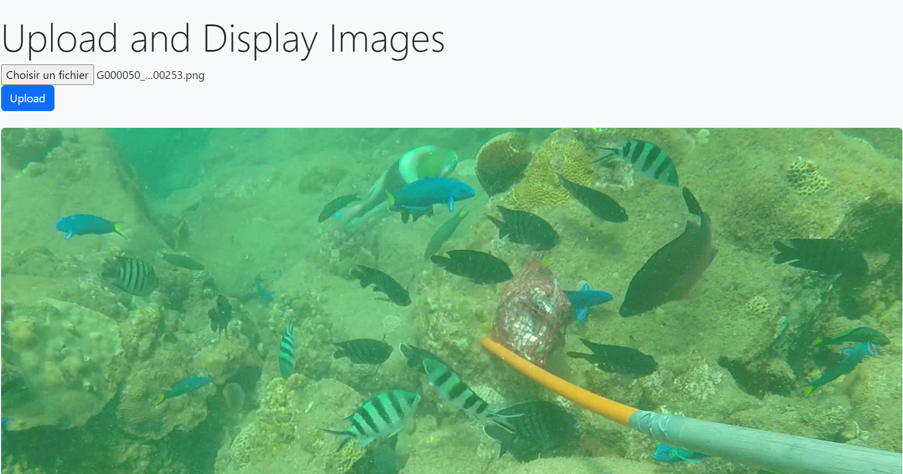
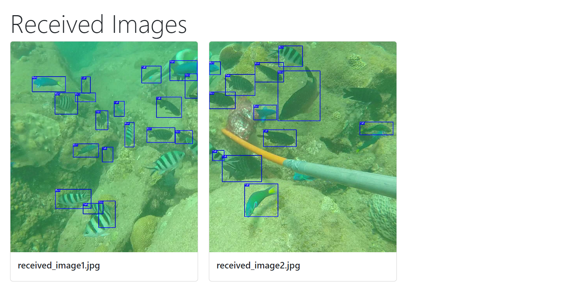

# Collaborative Fog Node Fish Detection

## Description

This project is a collaborative fog node-based fish detection system. It leverages fog computing to distribute image processing tasks across multiple clients and a server. The system is designed to detect fish in images and provide bounding box information using the Roboflow API.

## Features

- **Image Upload**: Users can upload an image of their choice to the application.
- **Image Processing**: The uploaded image is processed by a remote server using a machine learning model.
- **Result Display**: Processed images are displayed in the web application.
- **File Management**: The "received" directory is cleared before each server run.
## System Specifications

### Server

- RAM: 8
- Processor: i5 10éme gen

### Client 1

- RAM: 8
- Processor: i5 10éme gen
### Client 2

- RAM: 16
- Processor: i3 11éme gen

## Prerequisites

Before running the application, make sure you have the following installed:

- Python 3.x
- Flask
- Pillow (PIL)
- tqdm
- [Roboflow](https://roboflow.com/) (for machine learning model predictions)
- A machine learning model for image processing (used in the `server.py` script)

## Usage

1. **Clone the Repository**:
   - On your local machine, clone this main repository:
     ```bash
      git clone https://github.com/firas-chakroun/fog_computing_fish_detection.git
     ```
   - On other machines, clone the client repositories accordingly:
     

2. **Install Dependencies**:
   - Open your terminal in the project directory and install the required Python libraries using `pip`:
     ```bash
     pip install flask pillow roboflow tqdm
     ```

3. **Start the Server**:
   - Activate the Flask server by running the following command:
     ```bash
     python server/app.py
     ```

4. **Access the Web Interface**:
   - After the server is active, open a web browser and navigate to `localhost:5000`.

5. **Upload an Image**:
   - You can upload an image on the main page.

6. **Run the Clients**:
   - On the other machines, activate both client applications by running the following command on each machine:
     ```bash
     python client1/client.py
     ```
     ```bash
     python client2/client.py
     ```
    
7. **Get Results**:
   - Wait for the results to appear on the server machine. The collaborative "Fish Detection" project will process the uploaded image and display the results on the server.


<span style="color: red;">If there are any problems when running `server.py` or `client.py`, try to change the socket port and don't forget to change the server's IP address in `client.py`.<span>

## Project Phases


To set up this collaborative fish detection system, follow these steps:

### 1. Network Setup

After creating a local network, set up the server socket to accept connections from both client nodes.

### 2. Image Split and Distribution

Once both clients are connected, the server splits the image into two and sends each client one-half of the image.

### 3. Image Processing

On the client side, the image is processed, and the results are saved with bounding boxes using the Roboflow API trained for fish detection.

### 4. Server Communication

The server initializes another socket to accept images from the clients after the detection process. This communication can include either sending the processed image or a JSON file containing bounding box information (in case you need to count the fish). For performance reasons, we do not perform this action.

### 5. Flask Integration

After receiving the images and bounding boxes, install Flask and create Flask functionalities. Create a home page where users can upload an image. When an image is uploaded, the server will activate and wait for the clients to process it.

### 6. Displaying Results

Once the processing is completed by both clients, the results are displayed


## Performance & time Comparison

To evaluate the performance of this collaborative fish detection system, a comparison of execution times is conducted. A second server is introduced to perform fish detection in a traditional, non-distributed manner. The execution times of both servers are compared to determine the efficiency of the collaborative approach.

| Server Type                    | Processing Time |
| ------------------------------ | --------------- |
| Collaborative Fog Nodes Server |32s              |
| Non-Distributed Server         |35s              |

## Conclusion

In conclusion, this project showcases the power of collaborative fog nodes for efficient fish detection. The collaborative approach leverages distributed processing, making it potentially faster and more efficient than traditional methods. The comparison of execution times provides insights into the system's performance.This project serves as a practical example of distributed computing for image recognition tasks.
